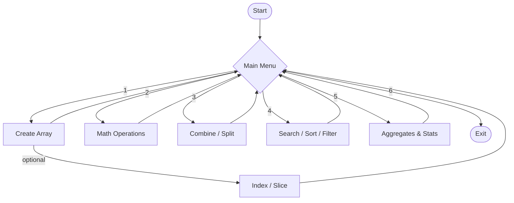
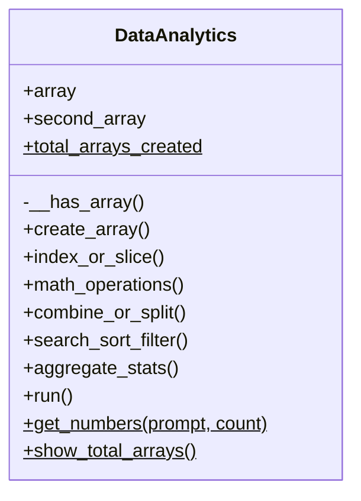

<div align="center">


[](https://git.io/typing-svg)


⭐ **If this project helped you, consider giving it a star!** ⭐

</div>

---

## 📌 About This Project

**NumPy Analyzer** is a console-based toolkit that combines the power of **NumPy** with
**Object-Oriented Programming**. Everything runs through a single class, `DataAnalytics`,
which lets you create arrays and run common data operations — math, searching, sorting,
filtering, and statistics — all from one clean, menu-driven interface.

> 🎯 **Objective:** Build a hands-on tool to practice NumPy array operations while applying
> real OOP concepts — encapsulation, class methods, and static methods — instead of writing
> everything as loose functions.

### 💡 Why This Project?

| | |
|---|---|
| 🧠 **Practical Learning** | Turns NumPy theory into a working, interactive tool |
| 🏗️ **Real OOP** | Not just a class wrapper — uses encapsulation, `@classmethod`, and `@staticmethod` with a purpose |
| 🧩 **Modular** | Each menu option maps to its own method, easy to read and easy to extend |
| 🖱️ **Zero Setup Friction** | One file, one dependency (`numpy`), runs anywhere Python runs |

---

## 📖 Table of Contents

- [✨ Features](#-features)
- [🏛️ Architecture](#️-architecture)
- [🧠 OOP Concepts in Action](#-oop-concepts-in-action)
- [🎥 Video Explanation](#-video-explanation)
- [📸 Screenshots](#-screenshots)
- [🛠️ Tech Stack](#️-tech-stack)
- [🚀 Getting Started](#-getting-started)
- [💻 Full Walkthrough](#-full-walkthrough)
- [📂 Project Structure](#-project-structure)
- [📝 Assumptions](#-assumptions)
- [🎓 Learning Outcomes](#-learning-outcomes)
- [🗺️ Roadmap](#️-roadmap)
- [❓ FAQ](#-faq)
- [🤝 Contributing](#-contributing)
- [📜 License](#-license)
- [👨‍💻 Author](#-author)

---

## ✨ Features

| Category | Emoji | What It Does |
|---|---|---|
| Array Management | 🧱 | Create 1D, 2D, and 3D arrays, then index or slice them |
| Math Operations | ➕ | Element-wise add, subtract, multiply, divide, plus dot product |
| Combine & Split | 🔗 | Stack two arrays together or split one into parts |
| Search, Sort & Filter | 🔍 | Find a value, sort ascending/descending, filter by condition |
| Aggregates | 📊 | Sum, mean, median, standard deviation, variance |
| Statistics | 📈 | Percentiles and correlation coefficient between arrays |
| OOP Design | 🏗️ | Encapsulated logic, one `@classmethod`, one `@staticmethod` |
| Menu-Driven UI | 🖱️ | Clean console menu that loops until the user exits |

---

## 🏛️ Architecture

### Menu Flow



### Class Design


*(`$` marks class-level / static members)*

---

## 🧠 OOP Concepts in Action

**🔒 Encapsulation** — a private, name-mangled method guards every operation:
```python
def __has_array(self):
    if self.array is None:
        print("\nNo array found. Please create an array first.")
        return False
    return True
```

**🏷️ Class Method** — tracks state shared across every object of the class:
```python
@classmethod
def show_total_arrays(cls):
    print(f"\nTotal arrays created in this session: {cls.total_arrays_created}")
```

**⚙️ Static Method** — a utility that doesn't need `self` or `cls` at all:
```python
@staticmethod
def get_numbers(prompt, count):
    values = input(prompt).split()
    return [float(v) for v in values[:count]]
```

---

## 🎥 Video Explanation

> 📌 *Drop your walkthrough video link below*

[](PUT_YOUR_VIDEO_LINK_HERE)

---

## 📸 Screenshots

> 📌 *Add terminal screenshots or a GIF of the tool in action here*

| Array Creation | Math Operations | Statistics |
|---|---|---|
| `PUT_IMAGE_LINK_HERE` | `PUT_IMAGE_LINK_HERE` | `PUT_IMAGE_LINK_HERE` |

---

## 🛠️ Tech Stack


---

## 🚀 Getting Started

### Prerequisites
- Python 3.8 or higher
- `numpy` library

### Installation

```bash
# 1. Clone the repository
git clone https://github.com/your-username/numpy-analyzer.git
cd numpy-analyzer

# 2. (Optional) create a virtual environment
python -m venv venv
source venv/bin/activate      # on Windows: venv\Scripts\activate

# 3. Install NumPy
pip install numpy

# 4. Run the analyzer
python numpy_analyzer.py
```

---

## 💻 Full Walkthrough

<details>
<summary>🧱 <b>1. Create a Numpy Array</b></summary>

```
Select the type of array to create:
1. 1D Array
2. 2D Array
3. 3D Array
Enter your choice: 2
Enter the number of rows: 2
Enter the number of columns: 3
Enter 6 elements for the array separated by space: 10 20 30 40 50 60

Array created successfully:
[[10 20 30]
 [40 50 60]]
```
</details>

<details>
<summary>✂️ <b>Indexing & Slicing</b></summary>

```
Choose an operation:
1. Indexing
2. Slicing
3. Go Back
Enter your choice: 2

Enter the row range (start:end): 0:2
Enter the column range (start:end): 1:3

Sliced Array:
[[20 30]
 [50 60]]
```
</details>

<details>
<summary>➕ <b>2. Perform Mathematical Operations</b></summary>

```
Choose a mathematical operation:
1. Addition
2. Subtraction
3. Multiplication
4. Division
5. Dot Product / Matrix Multiplication (2D only)
Enter your choice: 1

Enter the same-size array elements (6 elements separated by space): 5 5 5 5 5 5

Result of Addition:
[[15 25 35]
 [45 55 65]]
```
</details>

<details>
<summary>🔗 <b>3. Combine or Split Arrays</b></summary>

```
Choose an option:
1. Combine Arrays
2. Split Array
Enter your choice: 1

Enter the elements of another array to combine (6 elements separated by space): 1 2 3 4 5 6

Combined Array (Vertical Stack):
[[10 20 30]
 [40 50 60]
 [ 1  2  3]
 [ 4  5  6]]
```
</details>

<details>
<summary>🔍 <b>4. Search, Sort, or Filter Arrays</b></summary>

```
Choose an option:
1. Search a value
2. Sort the array
3. Filter values
Enter your choice: 2

Sort in ascending or descending order? (a/d): a

Sorted Array:
[[10 20 30]
 [40 50 60]]
(Sorting applied row-wise.)
```
</details>

<details>
<summary>📊 <b>5. Compute Aggregates and Statistics</b></summary>

```
Choose an aggregate/statistical operation:
1. Sum
2. Mean
3. Median
4. Standard Deviation
5. Variance
6. Percentile
7. Correlation with another array
Enter your choice: 3

Median of Array: 35.0
```
</details>

---

## 📂 Project Structure

```
numpy-analyzer/
├── numpy_analyzer.py   # Main source code (DataAnalytics class)
├── README.md           # You're reading it
└── requirements.txt    # Project dependencies
```

---

## 📝 Assumptions

- All array elements are entered as numbers (converted to `float` internally for consistency).
- The user enters exactly as many values as the array size requires.
- Sorting on multi-dimensional arrays is applied row-wise.
- Splitting uses `np.array_split`, so it also handles cases where the array can't be split evenly.
- Correlation and same-size math operations expect a second array of matching size, entered when prompted.

---

## 🎓 Learning Outcomes

- ✅ Creating and reshaping NumPy arrays across 1D, 2D, and 3D
- ✅ Applying encapsulation, class methods, and static methods correctly (not just for show)
- ✅ Using NumPy's math, aggregate, and statistical functions in a real interactive flow
- ✅ Structuring a multi-feature console app around a single, well-organized class
- ✅ Writing a project that's documented well enough for someone else to run without help

---

## 🗺️ Roadmap

- [ ] Export results to CSV / JSON
- [ ] Add unit tests with `pytest`
- [ ] Wrap invalid inputs in proper `try/except` blocks
- [ ] Build a lightweight GUI version (Tkinter or Streamlit)
- [ ] Add broadcasting examples for mismatched array shapes

---

## ❓ FAQ

**Q: Do I need anything besides NumPy?**
A: No — just Python 3.8+ and `numpy`. No other dependencies.

**Q: What happens if I enter the wrong number of elements?**
A: The array creation step expects an exact match; mismatched input will raise a reshape error, so double-check the count before hitting enter.

**Q: Can I use this on arrays larger than what's shown in the examples?**
A: Yes, the size is fully driven by what you enter at each prompt — the examples just keep things small and readable.

---

## 🤝 Contributing

This started as a learning project, but suggestions are welcome:

1. Fork the repo
2. Create a branch (`git checkout -b feature/your-feature`)
3. Commit your changes
4. Open a pull request

---

## 📜 License

This project is licensed under the **MIT License** — free to use, modify, and share.

---

<div align="center">

## 👨‍💻 Author

**Nihar Sheladiya**

Made with ❤️ and a lot of ☕


</div>
