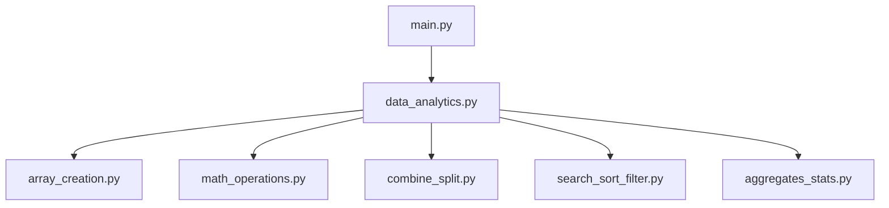
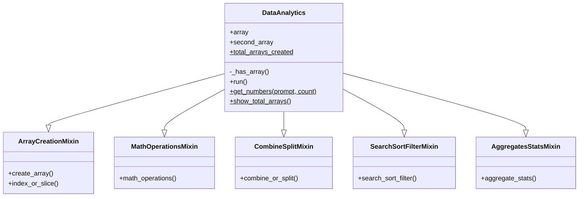

<div align="center">


[](https://git.io/typing-svg)


⭐ **If this project helped you, consider giving it a star!** ⭐

</div>

---

## 📌 About This Project

**NumPy Analyzer** started as a single Python file and grew into a small, properly organized
package. It still runs entirely from the console, but the logic now lives across dedicated
modules that plug into one central class — `DataAnalytics` — instead of one giant file.

> 🎯 **Objective:** Practice real NumPy array operations while applying OOP the way it's
> actually used in bigger codebases — one class, multiple responsibilities, split cleanly
> across files.

---

## 📖 Table of Contents

- [🗂️ Project Structure](#️-project-structure)
- [📋 File-by-File Breakdown](#-file-by-file-breakdown)
- [🏛️ Architecture](#️-architecture)
- [🧩 Why Mixins?](#-why-mixins)
- [✨ Features](#-features)
- [🎥 Video Explanation](#-video-explanation)
- [🛠️ Tech Stack](#️-tech-stack)
- [🚀 Getting Started](#-getting-started)
- [💻 Full Walkthrough](#-full-walkthrough)
- [📝 Assumptions](#-assumptions)
- [🧠 What This Project Demonstrates](#-what-this-project-demonstrates)
- [🗺️ Roadmap](#️-roadmap)
- [❓ FAQ](#-faq)
- [🤝 Contributing](#-contributing)
- [📜 License](#-license)
- [👨‍💻 Author](#-author)

---

## 🗂️ Project Structure

```
numpy-analyzer/
│
├── 🚪 main.py                 # Entry point — creates DataAnalytics() and runs it
├── 🧠 data_analytics.py       # The DataAnalytics class — combines all mixins + main menu
├── 🧱 array_creation.py       # ArrayCreationMixin — create, index, slice arrays
├── ➕ math_operations.py      # MathOperationsMixin — add, subtract, multiply, divide, dot product
├── 🔗 combine_split.py        # CombineSplitMixin — combine & split arrays
├── 🔍 search_sort_filter.py   # SearchSortFilterMixin — search, sort, filter
├── 📊 aggregates_stats.py     # AggregatesStatsMixin — sum, mean, median, std, variance, stats
├── 📦 requirements.txt        # Project dependency: numpy
└── 📘 README.md               # You're reading it
```

---

## 📋 File-by-File Breakdown

| File | Class Inside | Responsibility |
|---|---|---|
| `main.py` | — | Starts the whole program |
| `data_analytics.py` | `DataAnalytics` | Shared state, menu loop, the class/static/private helpers |
| `array_creation.py` | `ArrayCreationMixin` | 1D / 2D / 3D array creation, indexing, slicing |
| `math_operations.py` | `MathOperationsMixin` | Element-wise math + dot product |
| `combine_split.py` | `CombineSplitMixin` | Stack two arrays / split one into parts |
| `search_sort_filter.py` | `SearchSortFilterMixin` | Search a value, sort, filter by condition |
| `aggregates_stats.py` | `AggregatesStatsMixin` | Sum, mean, median, std dev, variance, percentile, correlation |

---

## 🏛️ Architecture

### Module Dependency Graph



### Class Composition


*(`$` marks class-level / static members, `-` marks a private/internal member)*

---

## 🧩 Why Mixins?

Instead of writing five unrelated helper classes, each file defines a **mixin** — a small class
that only makes sense combined with others. `DataAnalytics` then inherits from all five at once:

```python
class DataAnalytics(
    ArrayCreationMixin,
    MathOperationsMixin,
    CombineSplitMixin,
    SearchSortFilterMixin,
    AggregatesStatsMixin,
):
    ...
```

The result still behaves as **one single class** — exactly what the project brief asks for —
but the code behind it is split into readable, single-purpose files instead of one long script.

---

## ✨ Features

| Category | Emoji | What It Does |
|---|---|---|
| Array Management | 🧱 | Create 1D, 2D, and 3D arrays, then index or slice them |
| Math Operations | ➕ | Element-wise add, subtract, multiply, divide, plus dot product |
| Combine & Split | 🔗 | Stack two arrays together or split one into parts |
| Search, Sort & Filter | 🔍 | Find a value, sort ascending/descending, filter by condition |
| Aggregates | 📊 | Sum, mean, median, standard deviation, variance |
| Statistics | 📈 | Percentiles and correlation coefficient between arrays |
| OOP Design | 🏗️ | Mixin-based class, one `@classmethod`, one `@staticmethod` |

---

## 🎥 Video Explanation

> 📌 *Drop your walkthrough video link below*

[](PUT_YOUR_VIDEO_LINK_HERE)

---

## 🛠️ Tech Stack


---

## 🚀 Getting Started

### Prerequisites
- Python 3.8 or higher
- `numpy` library

### Installation

```bash
# 1. Clone the repository
git clone https://github.com/your-username/numpy-analyzer.git
cd numpy-analyzer

# 2. (Optional) create a virtual environment
python -m venv venv
source venv/bin/activate      # on Windows: venv\Scripts\activate

# 3. Install dependencies
pip install -r requirements.txt

# 4. Run the analyzer
python main.py
```

---

## 💻 Full Walkthrough

<details>
<summary>🧱 <b>array_creation.py</b> — Create a Numpy Array</summary>

```
Select the type of array to create:
1. 1D Array
2. 2D Array
3. 3D Array
Enter your choice: 2
Enter the number of rows: 2
Enter the number of columns: 3
Enter 6 elements for the array separated by space: 10 20 30 40 50 60

Array created successfully:
[[10 20 30]
 [40 50 60]]
```
</details>

<details>
<summary>➕ <b>math_operations.py</b> — Perform Mathematical Operations</summary>

```
Choose a mathematical operation:
1. Addition
2. Subtraction
3. Multiplication
4. Division
5. Dot Product / Matrix Multiplication (2D only)
Enter your choice: 1

Enter the same-size array elements (6 elements separated by space): 5 5 5 5 5 5

Result of Addition:
[[15 25 35]
 [45 55 65]]
```
</details>

<details>
<summary>🔗 <b>combine_split.py</b> — Combine or Split Arrays</summary>

```
Choose an option:
1. Combine Arrays
2. Split Array
Enter your choice: 1

Enter the elements of another array to combine (6 elements separated by space): 1 2 3 4 5 6

Combined Array (Vertical Stack):
[[10 20 30]
 [40 50 60]
 [ 1  2  3]
 [ 4  5  6]]
```
</details>

<details>
<summary>🔍 <b>search_sort_filter.py</b> — Search, Sort, or Filter Arrays</summary>

```
Choose an option:
1. Search a value
2. Sort the array
3. Filter values
Enter your choice: 2

Sort in ascending or descending order? (a/d): a

Sorted Array:
[[10 20 30]
 [40 50 60]]
(Sorting applied row-wise.)
```
</details>

<details>
<summary>📊 <b>aggregates_stats.py</b> — Compute Aggregates and Statistics</summary>

```
Choose an aggregate/statistical operation:
1. Sum
2. Mean
3. Median
4. Standard Deviation
5. Variance
6. Percentile
7. Correlation with another array
Enter your choice: 3

Median of Array: 35.0
```
</details>

---

## 📝 Assumptions

- All array elements are entered as numbers (converted to `float` internally for consistency).
- The user enters exactly as many values as the array size requires.
- Sorting on multi-dimensional arrays is applied row-wise.
- Splitting uses `np.array_split`, so it also handles cases where the array can't be split evenly.
- Correlation and same-size math operations expect a second array of matching size, entered when prompted.

---

## 🧠 What This Project Demonstrates

- ✅ Splitting one growing class across multiple files without breaking its behavior
- ✅ Using mixins to keep multiple inheritance clean and purpose-driven
- ✅ Correctly handling Python's private-name mangling limits across files
- ✅ Applying `@classmethod` and `@staticmethod` where they actually belong, not just for show
- ✅ Reshaping and operating on NumPy arrays across 1D, 2D, and 3D
- ✅ Writing documentation clear enough for someone else to run the project unassisted

---

## 🗺️ Roadmap

- [ ] Export results to CSV / JSON
- [ ] Add unit tests with `pytest` for each mixin
- [ ] Wrap invalid inputs in proper `try/except` blocks
- [ ] Build a lightweight GUI version (Tkinter or Streamlit)
- [ ] Add broadcasting examples for mismatched array shapes

---

## ❓ FAQ

**Q: Why split one class across so many files?**
A: It mirrors how real projects grow — one class, one responsibility per file, instead of a single script that keeps getting longer.

**Q: Do I need anything besides NumPy?**
A: No — just Python 3.8+ and `numpy`, installed via `requirements.txt`.

**Q: What happens if I enter the wrong number of elements?**
A: Array creation expects an exact match; a mismatched count will raise a reshape error, so double-check before pressing enter.

---

## 🤝 Contributing

This started as a learning project, but suggestions are welcome:

1. Fork the repo
2. Create a branch (`git checkout -b feature/your-feature`)
3. Commit your changes
4. Open a pull request

---

## 📜 License

This project is licensed under the **MIT License** — free to use, modify, and share.

---

<div align="center">

## 👨‍💻 Author


### Nihar Sheladiya

*PUT_YOUR_TAGLINE_HERE — e.g. "Python Developer | Learning OOP & Data Analysis with NumPy"*

Built this project to move past notebook-style code and actually structure a NumPy-based
tool the way a real, class-based Python project would be organized.

[](PUT_YOUR_GITHUB_LINK_HERE)
[](PUT_YOUR_LINKEDIN_LINK_HERE)
[](mailto:PUT_YOUR_EMAIL_HERE)

Made with ❤️ and a lot of ☕


</div>
